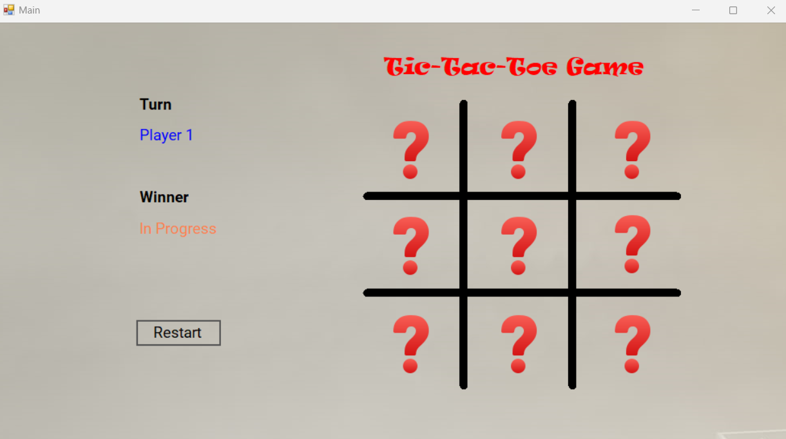
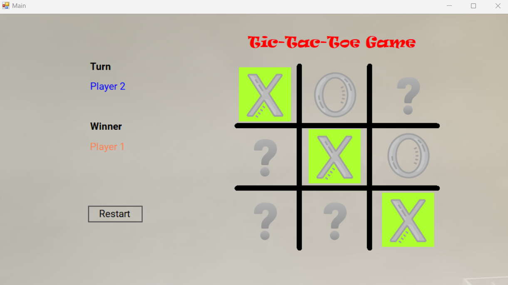

# TicTacToeGame

A classic Tic Tac Toe game built using C# and Windows Forms. This project allows two players to play the game, and it includes features such as turn tracking, winner detection, and the ability to restart the game. The graphical interface provides a smooth and interactive user experience.

<p align="center">
  
  
</p>

## Features

- Two-player Tic Tac Toe gameplay
- Real-time turn tracking
- Winner detection and display
- Option to restart the game
- Interactive and user-friendly interface

## Installation

1. Clone the repository:
```sh
git clone https://github.com/EngenMe/TicTacToeGame.git

```

2. Open the project in Visual Studio.
3. Build and run the application.

## Usage

1. Run the application.
2. Players take turns clicking on the grid to place their mark (X or O).
3. The game detects the winner and highlights the winning combination.
4. Click the "Restart" button to start a new game.

## License

This project is licensed under the MIT License. See the `LICENSE` file for details.

## Contributing

Contributions are welcome! Please feel free to submit a Pull Request.
